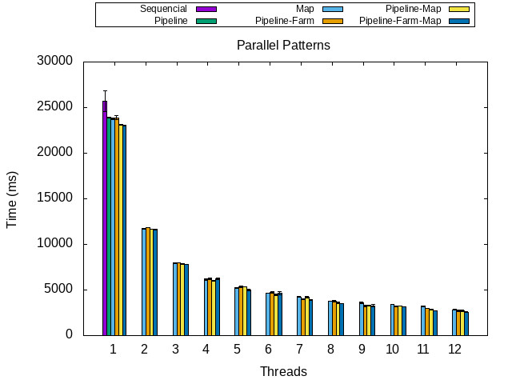

## [Example 1](example-1)




## [Example 2](example-2)


## Other ideas

You can combine Gnuplot with other programming languages to process raw data and create the `.dat` file. To run a Python script within a Gnuplot script, for example, you should use the folowing:

```gnuplot
!python process-data.py
```